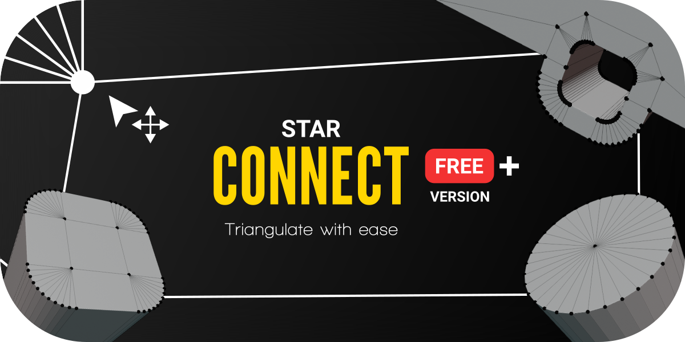

Star Connect
=============

**Star Connect** makes the mesh triangulation process easier then ever before, by introducing its own mode.
Easily determine how your mesh should be triangulated, you have complete control.

Features
--------

**Star Connect Basic**

* Instead of joining the verts each by each you can connect all at once.

**Star Connect Pro**

* Experience a new mode with smart bevel detection and intuitive tools to bring your triangulation at its best.
  Including a blender-like selection, undo and redo system to feel familiar from the first moment.
* Find all features under :doc:`star_connect_mode`
|

Support
-------

If you have any questions get in touch via :doc:`contact`.

|
Contents
--------

.. toctree::
   :maxdepth: 2

   installation
   update
   changelog
   star_connect_mode
   contact
|